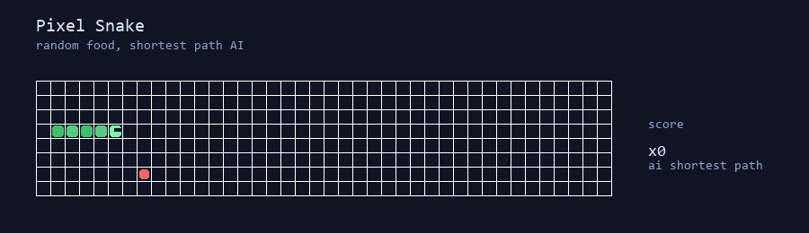

# Hi there, I'm 小呆呆

> 星凝眉上字，潮敛贝中音。

[Play Pixel Snake](snake-game.html)

## About Me

- 记录技术，也记录生活和审美
- 主站：`xiaodaidai.site`
- 关注：前后端开发、Hexo/Astro 站点建设、3D 世界、实用工具
- 常写内容：游戏赏析、AI 写作、博客维护、文学随笔、日常观察
- 也喜欢把喜欢的作品拆开看，比如《鸣潮》《光与影：33号远征队》这类有美术和叙事质感的东西

## My Build

## Featured Works

| Project | Vibe | Tech |
| --- | --- | --- |
| Dream Fluid Blog | 个人博客主站，记录技术与生活 | Astro, React |
| 3D World | 从空白平面到可交互场景的站点实验 | WebGL / Three.js |
| Utility Tools | 站内实用工具与功能页 | JavaScript |
| Writing Notes | AI 写作、Markdown、随笔和评测 | Hexo / Markdown |

## Connect

- Blog: https://xiaodaidai.site
- GitHub: https://github.com/hengjiasteven-dotcom
- Bilibili: https://space.bilibili.com/YOUR_ID

---

> 今日も、少しずつ前へ。
